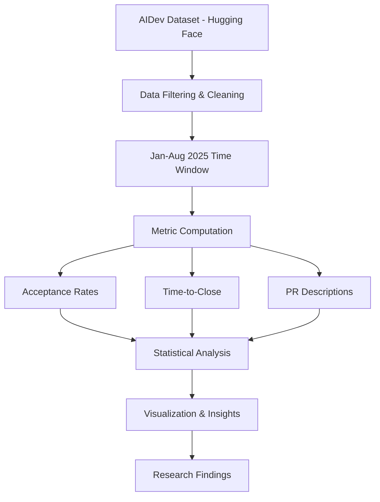

# 🤖 AIDev Activity – Part 2

<div align="center">

**AI Coding Agent Collaboration Analysis**

*Mining Software Repositories – MSR 2026*

[](https://github.com/NouhaAwachri)
[]()
[](https://huggingface.co/datasets/hao-li/AIDev)
[]()

</div>

---

## 📖 About

AIDev Activity – Part 2 is a **large-scale empirical study** analyzing how AI coding agents collaborate on GitHub. It investigates **acceptance behavior, review dynamics, and adoption trends** across more than **859,000 AI-generated pull requests** using the AIDev dataset.

> 💡 Most software engineering research focuses on human developers. This project shifts the focus to **AI-generated pull requests**, providing insights into how modern AI coding tools behave in real-world repositories.

---

## 🎯 Key Features

<table>
<tr>
<td width="50%">

### 🤖 Multi-Agent Analysis
Comparison across major AI coding agents:
- OpenAI Codex
- GitHub Copilot
- Cursor
- Devin
- Claude Code

</td>
<td width="50%">

### ✅ PR Acceptance Metrics
Deep dive into pull request outcomes:
- Merged vs rejected PRs
- Agent-specific acceptance rates
- Repository patterns

</td>
</tr>
<tr>
<td width="50%">

### ⏱️ Review Dynamics
Temporal analysis including:
- Time-to-close statistics
- Review count distributions
- Closure patterns

</td>
<td width="50%">

### 📝 Description Analysis
Impact of PR descriptions on:
- Acceptance likelihood
- Review efficiency
- Merge success rates

</td>
</tr>
</table>

### Additional Capabilities

- 📈 **Temporal Adoption Trends** – Track monthly activity and agent dominance over time
- 📊 **Statistical Validation** – Chi-square and Kruskal–Wallis hypothesis testing
- 🎨 **Publication-Quality Visualizations** – Clear, informative charts and graphs

---

## 🏗️ Analysis Pipeline



---

## ⚙️ Tech Stack

| Category | Technologies |
|----------|-------------|
| **Language** |  |
| **Data Processing** | `pandas` • `numpy` • `pyarrow` |
| **Statistics** | `scipy` |
| **Visualization** | `matplotlib` • `seaborn` |
| **Data Source** | Hugging Face Datasets (Parquet) |
| **Platform** | GitHub • GitHub Pages |

---

## 🚀 Getting Started

### Prerequisites

- Python 3.8 or higher
- 4GB+ RAM recommended
- Internet connection (for dataset download)

### Installation

**1. Clone the Repository**

```bash
git clone https://github.com/NouhaAwachri/Mining-Software-Repositories-with-AIDev-dataset
cd Mining-Software-Repositories-with-AIDev-dataset
```

**2. Install Dependencies**

```bash
pip install pandas numpy matplotlib seaborn scipy pyarrow
```

*Or use requirements.txt:*

```bash
pip install -r requirements.txt
```

**3. Run the Analysis**

```bash
python simple_aidev_analysis.py
```

### 📊 Expected Output

- ✅ Statistical summaries in console
- 📈 Publication-quality visualizations
- 💾 CSV file: `aidev_analysis_data.csv` (859K+ pull requests)

**Expected Runtime:** < 5 minutes on standard hardware

---

## 📁 Project Structure

```
Mining-Software-Repositories-with-AIDev-dataset/
├── simple_aidev_analysis.py    # Main analysis script
├── aidev_analysis_data.csv     # Output dataset
├── visualizations/             # Generated charts
├── requirements.txt            # Python dependencies
├── README.md                   # This file
└── LICENSE                     # License information
```

---

## ⚠️ Limitations

> **Important Considerations**

- 🔗 **Commit-level PR size metrics unavailable** – Missing PR-to-commit linkage in dataset
- 💬 **Comment data not directly linked** – Comments cannot be reliably associated with specific PRs
- ⚖️ **Strong agent imbalance** – OpenAI Codex represents ≈88.6% of all PRs
- 🔬 **Correlational analysis only** – No causal claims can be made from observations

---

## 🗺️ Roadmap

| Status | Feature |
|--------|---------|
| ✅ | Dataset loading & preprocessing |
| ✅ | Acceptance and review metrics |
| ✅ | Statistical testing (Chi-square, Kruskal–Wallis) |
| ✅ | Visualization pipeline |
| ⏳ | Extended repository-level analysis |
| ⏳ | Cross-dataset validation |
| 📋 | Longitudinal trend analysis |
| 📋 | Agent behavior clustering |

---

## 📚 References

- **AIDev Dataset Paper:** [arXiv:2507.15003](https://arxiv.org/abs/2507.15003)
- **Hugging Face Dataset:** [hao-li/AIDev](https://huggingface.co/datasets/hao-li/AIDev)
- **MSR 2026 Challenge:** [Official Website](https://2026.msrconf.org/track/msr-2026-mining-challenge)

---


## 👤 Author

**Nouha Aouachri**

- GitHub: [@NouhaAwachri](https://github.com/NouhaAwachri)
- Project: [Mining Software Repositories with AIDev Dataset](https://github.com/NouhaAwachri/Mining-Software-Repositories-with-AIDev-dataset)

---

## ⭐ Show Your Support

Give a ⭐️ if this project helped you!

---

